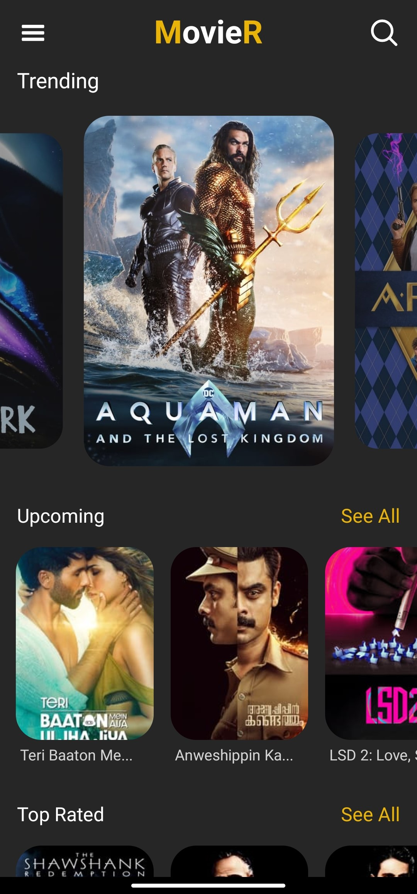
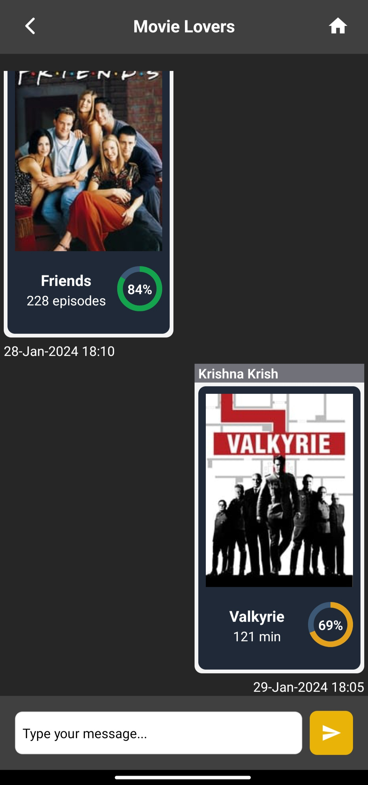
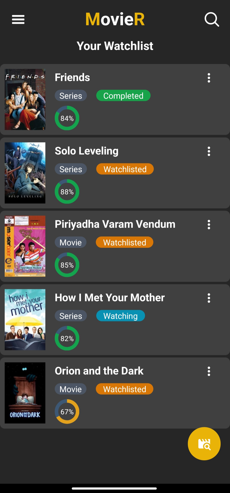

# MovieR

MovieR is an application that allows users to discover, search, and get information about movies and TV series. The app provides a user-friendly interface to explore a vast collection of movies, view details, manage watchlists, and watch trailers. 

  

## Features

- **Discover Movies:** Explore a diverse range of movies and TV series.
- **Search Functionality:** Easily search for your favorite movies or TV shows.
- **Detailed Information:** Get comprehensive details about each movie, including ratings, genres, and release information.
- **Watch Trailers:** Watch trailers for movies directly within the app.
- **Share Movies/Series:** Share the movies/series that you loved with your friends and family.
- **Watchlists:** Add movies/series that you want to watch and manage your progress.

## Technologies Used

- **Expo:** The app is built using the Expo Go framework for cross-platform development.
- **Firebase:** Firebase is used for authentication and real-time data updates.
- **Nativewind:** Nativewind is used for app styling.

## Installation

1. Clone the repository:

   ```bash
   git clone https://github.com/Krishnakrish77/movier.git
2. Install dependencies:

    ```bash
    cd movier
    npm install
3. Configure firebase:

    Create a firebase project at https://console.firebase.google.com. Get your firebase config file and replace firebaseConfig constant in firebaseConfig.js with your app's configurations. The project uses firestore database to store all information. 

3. Run the app:
    ```bash
    npm start
## Usage

- Open the app on your mobile device, web or emulator. This app is more focused on running on mobile devices and might be not well styled for laptop screens. The deployed web app is available at https://movier-88f92.web.app/

- Explore movies, search for specific titles, and view detailed information. 

    

- Create, join groups or invite friends to your groups and share your favourite movies and series.

    

- Add Movies/TV series and manage your watchlist.

    

## Author

[Krishna Krish](https://github.com/Krishnakrish77)

## License

MIT